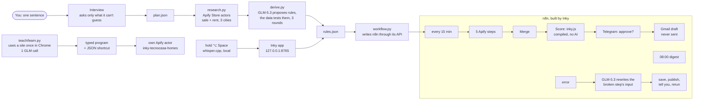

# Inky

**Tell it once.** You describe a goal in plain words. Inky researches it with Apify, learns the sites it needs, then builds and runs its own n8n workflow. It fixes that workflow when a step breaks, and it only asks you when there's a decision to make.

> Good listings go in days. Inky watches every 15 minutes; you only decide.

The demo task: *where can a Dutch buyer with €200,000 earn the most renting out a flat, in a place where prices are rising and buying is easy?* Inky compares Porto, Bari and Łódź.

## The problem

A good flat at a fair price is often gone within days. To catch one you check three portals in three languages several times a day, and you do the maths for every listing: rent nearby, agency fees, empty months, tax, buying costs. Inky does the checking and the maths every 15 minutes, day and night. You only see the homes that pass your rules, and you tap once to approve one.

## How it works



AI is used only where judgement is needed: the interview, proposing rules, labelling a learned site once, and repairing a broken step. Scraping, scoring and the 15-minute loop are compiled code with no model in them. More detail: [docs/architecture.md](docs/architecture.md).

## Real results (Saturday 26 September 2026)

| What | Result |
|---|---|
| Research | 17,836 listings read through Apify Store actors (idealista for Porto and Bari, immobiliare for Bari, otodom for Łódź). 13,421 for sale, 4,415 for rent, 39 neighbourhoods with rent data. $17.49 of Apify. |
| Rules | GLM-5.3 (open weights, via OpenRouter) proposed rules and the data tested them, 3 rounds: 15 → 70 → 46 matching homes. 3 calls, $0.15. |
| Where | Łódź 32 homes (best: Śródmieście, 6.5% a year after costs). Bari 14 (best: Libertà, 6.3%). Porto 0: prices rose 17.8% in a year (Eurostat, 2026-Q1), but rents are too low for the price. |
| Learn a site | Tecnocasa, Italy's largest agency network, had no Apify actor. Inky used the site once in Chrome: 10 steps, 1 GLM call ($0.02). It found the JSON feed behind the page, so 8 steps became 1 request, and published it as its own Apify actor, `cavernous_stew/inky-tecnocasa-homes`. Test run: 20 of 20 listings, under $0.001. |
| Race | 8 windows running the compiled program read all 96 Bari Tecnocasa flats under €200,000 in 19.7 s with 0 model calls. A click-by-click GLM agent read 30 in 60 s with 5 model calls ($0.085). |
| n8n | Inky created both workflows through the n8n API. The main one runs every 15 minutes: 5 Apify steps (the 4 Store actors plus Inky's own Tecnocasa actor) → Merge → compiled scoring (a Code node running `inky.js`, about 1.8 s, no AI) → Telegram approval → Gmail draft. Plus an 08:00 digest. |
| Repair | Tested live on Saturday at 23:30: we broke the otodom step's input on purpose. The run failed, and the repair workflow fixed it in 7.3 s ("Changed searchType from 'sale' to the allowed enum value 'sprzedaz'"), published it and reran. The rerun succeeded. |

Yields are estimates: rent from the median €/m² of rentals in the same neighbourhood, minus agency (9%), empty months (8%), upkeep, tax on rent and buying costs. The price trend is per country. Łódź districts are approximated from coordinates, because otodom returns none.

## Quickstart

Needs [uv](https://docs.astral.sh/uv/) and Node 24 (`inky.js` scores listings locally too).

**Without keys, no spend** (fixture listings, fixed rules, an n8n dry run):

```bash
uv sync
uv run python build.py --offline     # writes data-offline/: rules, research.json, both n8n workflows as JSON
uv run python test_pipeline.py       # the whole chain on fixtures, including the n8n Code nodes
.venv/bin/python app/test_serve.py   # every app endpoint, with GLM and n8n faked
```

See the app with no keys: `.venv/bin/python app/serve.py --demo` serves the bundled snapshot of Saturday's real data in `data-demo/`, and never calls n8n, Apify or GLM.

**The real thing:**

```bash
cp .env.example .env                 # fill in your keys, never paste them anywhere else
uv sync
uv run python build.py               # check -> test scrape (~$0.30) -> full scrape (capped per job) -> rules -> n8n
.venv/bin/python app/serve.py        # the app on http://127.0.0.1:8765
```

Resume after a failed step with `uv run python build.py --from <step>`.

| Step | Script | What it does |
|---|---|---|
| check | `check.py` | One free call per key. Never prints a key. |
| test-scrape, scrape | `research.py` | Sale and rent jobs on Apify Store actors for 3 cities, with a hard USD cap per job. |
| derive | `derive.py` | Rent and price per m² per neighbourhood, Eurostat price trend, ECB exchange rate. GLM-5.3 proposes rules, the data tests them, three rounds. |
| n8n | `workflow.py` | Creates the credentials, the main workflow and the repair workflow, and activates them. |

Before the first build: put your OpenRouter, Apify, n8n (base URL and API key) and Telegram bot keys in `.env` and send `/start` to your bot. Set a monthly usage limit in Apify. In n8n, add a Gmail OAuth2 credential and put its id in `N8N_GMAIL_CREDENTIAL_ID`. The official Apify node (`@apify/n8n-nodes-apify`) is used when it is installed, and n8n's HTTP node on the Apify API otherwise.

Optional parts, each with its own README: [teach/](teach/README.md) (learn a site), [race/](race/README.md) (the 8-window race), [voice/](voice/README.md) (⌥ Space), [app/](app/README.md) (the local app).

## What's open and what isn't

- **Inky's code** (this repo): open source, MIT.
- **The model**: GLM-5.3, open weights (MIT). Inky calls it through OpenRouter, which is a hosted service.
- **Speech**: whisper.cpp (MIT), running locally. Your voice never leaves the Mac.
- **Browser**: Playwright (Apache-2.0) and your own Chrome. The actor uses the Apify SDK (Apache-2.0).
- **n8n** is fair-code (source-available, self-hostable under its Sustainable Use License). The demo runs on n8n Cloud.
- **Apify's platform is hosted.** The Store actors used for research are third-party actors; Inky's own Tecnocasa actor is in this repo (`teach/actor/`).
- **Telegram and Gmail** are hosted services.

## Repo layout

```
build.py          one command from keys to a running agent (--offline: no keys, no spend)
check.py          checks each key with one free call
research.py       Apify Store actors: sale and rent listings for 3 cities
derive.py         neighbourhood stats, costs, GLM-5.3 rules in 3 rounds -> data/rules.json, data/research.json
inky.js           the compiled program: normalise and score listings, locally and inside the n8n Code node
workflow.py       writes the main and repair n8n workflows through the n8n API
test_pipeline.py  offline check of the whole chain
plan.json         the plan from the interview
app/              the local app (serve.py, stdlib only) and its front-end
teach/            learn a site once, replay it with no model, publish it as an Apify actor
race/             8 compiled windows against a click-by-click LLM agent
voice/            hold ⌥ Space: ffmpeg + whisper.cpp + Hammerspoon
docs/             architecture, video script and shots, pitch notes
```

`data/`, `data-offline/` and `.env` are git-ignored.

## Safety

- **It never contacts anyone.** An approved home becomes a Gmail *draft* to the agent. Nothing is ever sent for you. Telegram messages go only to you.
- **It asks first.** Every match waits for your tap in Telegram before a draft is made.
- **Repairs are limited.** It rewrites only the input of the one step that failed, tells you what it changed, and fixes at most once an hour. After that, a human decides.
- **Spend is capped.** Every Apify step in the workflow has a USD cap per run, and each research job has a hard USD cap.
- **Quiet hours.** Matches found between 23:00 and 07:00 (Amsterdam time) are held, and the first run after 07:00 asks you.
- **Keys stay in `.env`**, which is git-ignored, and `check.py` never prints them. We scanned the whole git history for keys before publishing.
- **The app is local.** It answers only on 127.0.0.1 or localhost and refuses POSTs from other websites. When you share an agent, your budget is never sent to the model.

## Credits

Built at Young Creators Build Weekend with Prosus, 26–27 September 2026. Thanks to [Apify](https://apify.com) (the platform and the Store actors by igolaizola, memo23 and trev0n), [n8n](https://n8n.io), [Z.ai](https://z.ai) for GLM-5.3, [OpenRouter](https://openrouter.ai), [whisper.cpp](https://github.com/ggml-org/whisper.cpp), [Hammerspoon](https://www.hammerspoon.org), [Playwright](https://playwright.dev), Eurostat and the ECB for open data. Otodom and Imovirtual belong to OLX, a Prosus company.
