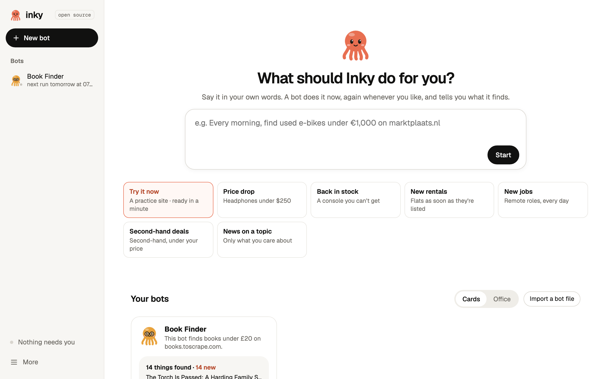
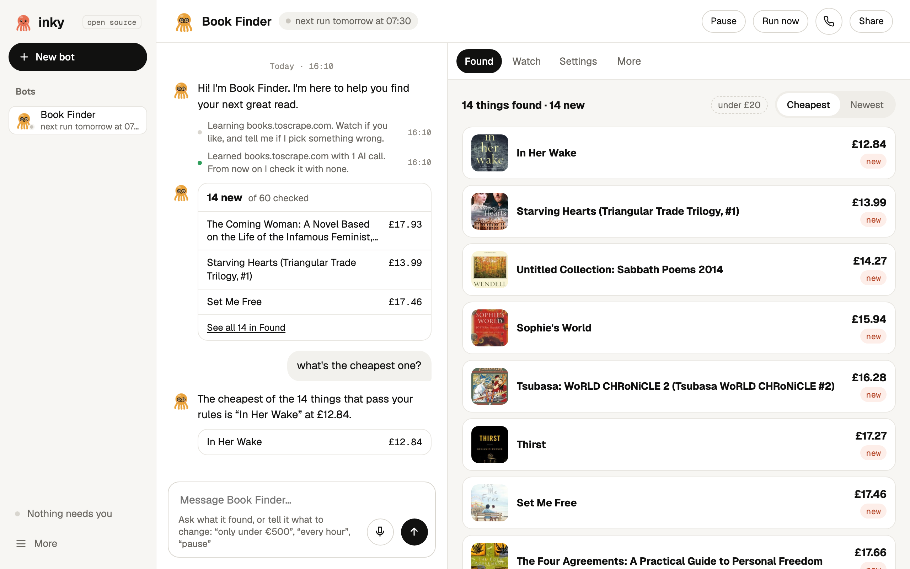

<p align="center"></p>

<h1 align="center">Inky</h1>

<p align="center"><b>Little bots that watch the web for you.</b><br>
Tell a bot what to look for in plain words. It learns the site once with AI, then checks it for free on your own computer,<br>tells you only what's new, and always asks before it does anything it can't undo.</p>

<p align="center">
<a href="https://github.com/GHGuide/inky/releases/latest"><b>Download</b></a> ·
<a href="#how-it-works">How it works</a> ·
<a href="#privacy-and-safety">Privacy and safety</a> ·
<a href="#faq">FAQ</a> ·
<a href="CONTRIBUTING.md">Contributing</a>
</p>

<p align="center">
<a href="https://github.com/GHGuide/inky/actions/workflows/ci.yml"></a>
<a href="LICENSE"></a>

</p>

<p align="center"></p>

## Why Inky

Hosted AI agents (Grok Bot, ChatGPT agent and friends) call a model on every step of every run. That's slow, it costs tokens every time, and it breaks in new ways each run. Monitoring tools (Visualping, Browse AI, Distill) are cheaper, but you pick CSS boxes, buy credits, and they go quiet when a site changes.

Inky does the expensive part once:

1. **You describe the job.** "Tell me when Sony WH-1000XM5 headphones drop below €250." It drafts the bot and finds the sites.
2. **It learns each site once, with AI**, while you can watch, and saves the steps it took.
3. **It repeats those steps on a schedule, with no AI at all.** Free, fast, and the same every time.
4. **It tells you what's new**, not "the page changed": in the app, as a notification, or on Telegram, where you can also answer its questions.
5. **When a site changes, it fixes itself** or tells you plainly, and you can show it once.

| | Inky | Hosted AI agents | Website monitors |
|---|---|---|---|
| Cost of each check | **nothing** (no AI when it repeats) | tokens on every step | credits or a plan |
| Runs on | **your computer** (or your own server) | their cloud | their cloud or your browser |
| Limit on bots | **none** | 3–15 tasks on most plans | by plan |
| You describe the job in | **plain words** | plain words | CSS boxes and settings |
| Tells you | **what's new**, with a link | a summary | "the page changed" |
| Before sending, buying or deleting | **a hard rule in code: it asks you** | an AI decides whether to ask | n/a |
| Your logins and keys | **stay on your computer** | on their servers | on their servers |
| Source | **open (MIT)** | closed | mostly closed |

## What people use it for

- **Price drops**: a product under your price, on one shop or many.
- **Back in stock**: a console, a size, a booster box.
- **New rentals and listings**: flats as soon as they're posted, second-hand bikes under €1,000.
- **New jobs**: remote roles on a careers page or job board.
- **News on a topic**: new Hacker News stories about AI, every hour.
- **Do bots**: fill a form or send a message for you, always with your yes first.

Each of these is one click on the Home screen. **Try it now** uses a practice site and works in about half a minute.

## Download

| | |
|---|---|
| **macOS**, Apple Silicon (M1 and newer) | `Inky_x.y.z_aarch64.dmg` |
| **macOS**, Intel | `Inky_x.y.z_x64.dmg` |
| **Windows** 10 and 11 | `Inky_x.y.z_x64-setup.exe` (or the `.msi`) |
| **Linux** | `.AppImage`, `.deb` or `.rpm` |

Get them from **[the latest release](https://github.com/GHGuide/inky/releases/latest)**. The first time it opens, Inky downloads the bots' browser (Chromium, about 170 MB) into its folder.

**The first time you open it.** Inky isn't signed by Apple or Microsoft yet (that costs money every year), so your computer warns you once:

- **macOS:** open Inky, press **Done**, then go to **System Settings → Privacy & Security** and press **Open Anyway** (it shows for about an hour). Or, in Terminal: `xattr -dr com.apple.quarantine /Applications/Inky.app`
- **Windows:** on "Windows protected your PC", press **More info**, then **Run anyway**.
- **Linux (AppImage):** `chmod +x Inky_*.AppImage` and run it.

Every installer is built in public by [GitHub Actions](.github/workflows/release.yml). Check a download against `SHA256SUMS.txt` in the release, or with `gh attestation verify <file> -R GHGuide/inky`.

## How it works

**Setup takes two steps.** Inky picks the best model that fits your computer: a local one through [Ollama](https://ollama.com) (free, private, works offline; `gemma3:12b` is a good default) or a cloud key you paste (OpenRouter, Anthropic, OpenAI, Gemini, Groq, xAI, Mistral). The model is used only to learn a site or understand your chat. Repeating a job never needs it.

**A bot** has a name, a little critter, a chat, and its own browser that runs out of sight. Its tabs:

- **Found**: what it found, with picture, name, price and "new".
- **Watch**: its browser, live, while it learns or works. Press **Take over** to use it yourself, or **Show it once** when a site changed.
- **Settings**: schedule, rules ("Price at most 400", "Mentions remote") and what it may do.

**Light or dark** follows your system, or pick one in Settings → About.

**Chat with it** in plain words: "only keep ones under €500", "check every hour", "what did you find?", "pause". Simple commands work without a model.

<p align="center"> </p>

**When something goes wrong** (a site times out, your Wi-Fi drops, a page moves its button) the bot tries again by itself, quietly. It only asks you after the third failure in a row, in plain words, with one button that fixes it. Sites that block bots are skipped and named. Robot checks (CAPTCHAs) are never solved; it hands them to you.

**Optional extras**, all in More:

- **Phone:** get alerts and answer questions on Telegram.
- **Other computers:** run bots on a spare Mac or a Linux server, so they keep working while your laptop sleeps. Pair one with a link, a code or SSH.
- **Your own screen:** let a bot work in a visible window, with a coral frame. Press Esc to stop it, or move the mouse to take over. It's off until you allow it.
- **Connectors:** Claude Code, Codex, n8n, Apify, or any MCP server. Inky is an MCP server too, so other agents can list and run your bots. Approving things never happens from outside the app.
- **Share:** send a bot to a friend as a link, or get one from the [library](library/). What's shared is what it learned and its rules, never your logins, memory or results.

## Privacy and safety

- **Nothing leaves your computer** except the visits your bots make to the sites you chose, calls to the AI provider you picked (only while learning or chatting; none with a local model), and Telegram messages if you turn that on. There's no Inky account, no Inky server, and no telemetry.
- **Keys** live in the macOS Keychain. On Windows and Linux they're kept in a file in your Inky folder that only your user can read.
- **Your data** lives in `~/.inky` (bots, results, the bots' browser profiles). Delete that folder and it's gone.
- **Hard rules, enforced in code** (an AI can't override them):
  - It asks before sending, posting, deleting, submitting a form or signing up.
  - It never buys or pays, and never types a password. You sign in yourself, in its browser, if a site needs it.
  - It never solves robot checks.
  - Bots that find things never click "sell", "post an ad", "log in" or "register".
- **The local API** listens only on this computer (unless you turn on access from your network in Settings) and every call needs a token. The app's page refuses outside scripts and frames.

Found a security problem? Please read [SECURITY.md](SECURITY.md) and report it privately.

## Run it without the desktop app

From source (Python 3.11 or newer):

```bash
git clone https://github.com/GHGuide/inky && cd inky
python -m venv .venv && .venv/bin/pip install "playwright==1.63.0" "httpx==0.28.1"
.venv/bin/playwright install chromium
.venv/bin/python -m inky            # opens http://127.0.0.1:8800 in your browser
```

On a Linux server or a spare Mac, one line installs it as a service that survives reboots, and prints a link to pair it with your desktop app:

```bash
curl -fsSL https://raw.githubusercontent.com/GHGuide/inky/main/install.sh | sh
```

Or with Docker: `docker build -t inky . && docker run -d -p 8800:8800 -v inky-data:/data inky`

## FAQ

**Is it really free?** Repeating a job uses no AI, so it costs nothing. Learning a site takes a few AI calls once: free with a local model, usually a fraction of a cent with a cloud key.

**How well does it work?** It does best on sites that list things: shops, marketplaces, listings, job boards, news. Each run reads the same steps, so it's as reliable as the site is stable. When a site changes, it repairs the step or asks you to show it once. Some sites block bots; Inky says so and moves on. Small local models (under about 8B) learn noticeably worse, and the app warns you.

**Why do macOS and Windows warn me?** The builds aren't notarized or code-signed yet. They're built in public from this repository, so you can check exactly what you run (see [Download](#download)).

**Where do I see what it did?** Every bot's chat says what it ran, what it found and what it skipped. More → Activity has the full log.

**Can it log in to sites for me?** No, by design. If a site needs a login, you sign in once yourself in the bot's browser (Watch → Take over), and it keeps that session.

**How does it update?** The app checks for a new version a few seconds after it opens and every six hours, and offers it in a small bar: "Restart to update". Updates are signed, and the app checks that signature before installing.

**Does it keep running when the app is closed?** On your computer, while Inky is open (it can sit in the menu bar or tray). For bots that never sleep, move them to another computer or a server (More → Computers).

## Contributing

Inky is MIT-licensed and contributions are welcome: bug reports, new connectors, better learning on hard sites, translations, and bots for the [library](library/). Start with [CONTRIBUTING.md](CONTRIBUTING.md). The product goals and the pass/fail checks a release must meet are in [docs/vision.md](docs/vision.md) and [docs/acceptance.md](docs/acceptance.md).

## License

[MIT](LICENSE). The Geist fonts are under the SIL Open Font License ([inky/ui/fonts/OFL.txt](inky/ui/fonts/OFL.txt)). Brand logos belong to their owners and appear only to name each service ([inky/ui/logos/SOURCES.md](inky/ui/logos/SOURCES.md)).
