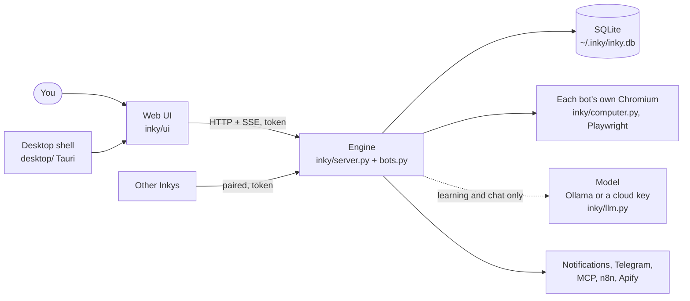

# How Inky is built

Inky is one Python process (the **engine**) that serves its own web UI. The desktop app is a thin Tauri shell around it; a server runs the same engine without the shell. Everything a person can do goes through the engine's HTTP API, so the app, the browser UI, other paired computers and MCP clients all see the same thing.

## Modules

| File | What it does |
|---|---|
| `inky/__main__.py` | Starts the engine: arguments, data folder, PATH fix for apps opened from the Dock |
| `inky/server.py` | HTTP API and static UI; token check, Host check, security headers; SSE events from `inky/bus.py` |
| `inky/bots.py` | The `Engine`: drafting a bot from a sentence, the scheduler, runs, chat (plain commands without a model), retries and quietly handled problems, the approval gate, notifications |
| `inky/skills.py` | Learning a site with a model, and replaying what it learned with no model |
| `inky/computer.py` | A bot's browser (Playwright in its own thread): the element table, the result-list finder (`LISTS_JS`), extraction, the on-page overlay |
| `inky/llm.py` | Every model provider behind one `ask_json`; streaming with a working Stop; picking the best local model that fits |
| `inky/sites.py` | Finding websites for a job: a gentle DuckDuckGo search, the model's own suggestions as a fallback, each checked to load |
| `inky/store.py` | A tiny SQLite document store (bots, skills, runs, results, needs, messages, events, settings) |
| `inky/keys.py` | Keys in the macOS Keychain, or a file only the user can read |
| `inky/safety.py` | Classifies a step: fine, irreversible, payment, password, robot check |
| `inky/connectors.py`, `mcp.py`, `mcp_server.py`, `codex_mcp.py` | Telegram, n8n, Apify; MCP clients (Claude Code, Codex, any server); Inky as an MCP server |
| `inky/connect.py`, `transfer.py` | Pairing, SSH setup, LAN discovery, Tailscale; moving a bot to another computer |
| `inky/library.py` | Share links, the public library, the checks a shared bot must pass |
| `inky/persona.py`, `growth.py`, `insights.py` | Personality, levels and diary, suggestions |
| `inky/ui/` | Vanilla JS, no framework and no build: `app.js` (shell, routing, state), `views.js` (every screen), CSS, critters, fonts, logos |
| `desktop/` | Tauri 2: windows (main, command bar, desktop buddy), tray, shortcuts, notifications, deep links; the engine ships as a PyInstaller sidecar |

## Learning once, repeating free

**Learning** (`skills.learn`) gives the model a numbered table of the page's elements and asks for one step at a time (click, type, press, go to, read the results, next page, done). Most of the work is the learner catching a small model's mistakes before they're saved:

- If the page already shows a priced list of results, it reads it without asking the model (`LISTS_JS` finds repeated items with links, titles and prices).
- Before saving results, the model takes one look: are these the kind of thing the job is about? A home page's feed, a category menu, or boys' bikes for an e-bike job are turned down.
- A search typed but never sent gets Enter pressed for it. "Go to Books" with a link's number clicks that link. A link to sell, post an ad or log in is refused for a finding job.
- A site that turns bots away is skipped. A robot check stops and hands over to you. A start page that is only a sign-in form stops as "sign in first" before anything is typed; a 404 stops at once, with no AI calls.
- A search that empties a page that already listed results is undone (and can't be typed again), and the model is told to read the list instead. A few featured items next to a link named like the job ("Laptops") send the model to that link first. A link to the page it's already on is no step, and neither is opening one of the results the page lists. The same mistake three times running ends learning early.
- Each result keeps its own name and link: a link is a result's own only if it isn't one of a set (tags) and the results that share it are the same result; otherwise the name comes from the result's own words. A table's rows count as results even without links.
- After reading the results it looks for a next page: a Next link, an arrow, page numbers or Load more. With none, it scrolls to the end of the list once; if new results appear (infinite scroll), it saves a `scroll` step, with no model asked.
- What it learned is kept only if checking it again right away finds something.

The result is a **skill**: plain steps that find their targets again by role, name, text or CSS.

**Replay** (`skills.replay`) runs those steps with no model, reads up to three pages (a Next link, an arrow, page numbers, Load more, or a `scroll` step for a list that loads more as you scroll; each result once), waits a few seconds for a list that comes after the page, applies your rules, and marks what's new. If a step can't be found, it asks a model once to repair that one step, and only keeps the fix if it still finds results. Every run is recorded, and new items become one chat message and a notification.

## Things the engine guarantees

- **No model on the replay path.** Repairs are the only exception, and only when a step breaks.
- **The approval gate** (`Ctx.gate` in `bots.py`) is the only way past an irreversible step. It's a rule in code, not a model's judgement.
- **The token** guards every API call; the page that receives it checks the Host header.
- **Problems a bot can handle** (timeouts, offline, a changed page) are retried quietly. You're asked after three failures in a row.

## API

Every call needs the `X-Inky-Token` header (`?t=` for images and the event stream). The main routes:

| Route | What |
|---|---|
| `GET /api/state` | Everything the UI needs at once: bots, needs, settings |
| `POST /api/bots/draft` `{job}` | Draft a bot from a sentence |
| `POST /api/sites` `{job, queries}` | Find websites for a job |
| `POST /api/bots` | Create a bot; `POST /api/bots/{id}/learn` learns its sites |
| `POST /api/bots/{id}/run` | Check now (`{"wait": true}` waits for the result) |
| `GET /api/bots/{id}` | A bot with its skills, runs, messages and needs |
| `GET /api/bots/{id}/results` | What it found (with your rules applied) |
| `POST /api/bots/{id}/chat` `{text}` | Talk to it |
| `POST /api/bots/{id}/needs/{nid}` `{decision}` | Answer a question it asked |
| `GET /api/needs`, `GET /api/activity` | Needs you, and the full log |
| `GET /api/models`, `POST /api/models/connect`, `GET /api/models/live`, `POST /api/models/stop` | Models |
| `GET /api/connectors`, `POST /api/connectors/{name}/test` | Connectors |
| `POST /api/bots/{id}/share-code`, `POST /api/library/install` | Share and get bots |

`python -m inky.mcp_server` exposes the same through MCP: list bots, get one, message it, run it, read results and Needs you, create a bot (`POST /api/bots/from-job`, which works in the background so no call waits longer than a client does). Approving is deliberately not a tool. See [mcp.md](mcp.md).

## Tests

- `tests/test_*.py`: unit tests against a local test site (`tests/site_server.py`) with scripted models.
- `tests/journeys.py`: end-to-end journeys with a real local model on real sites, including the release gate (`five`).

See [CONTRIBUTING.md](../CONTRIBUTING.md) for how to run them.
