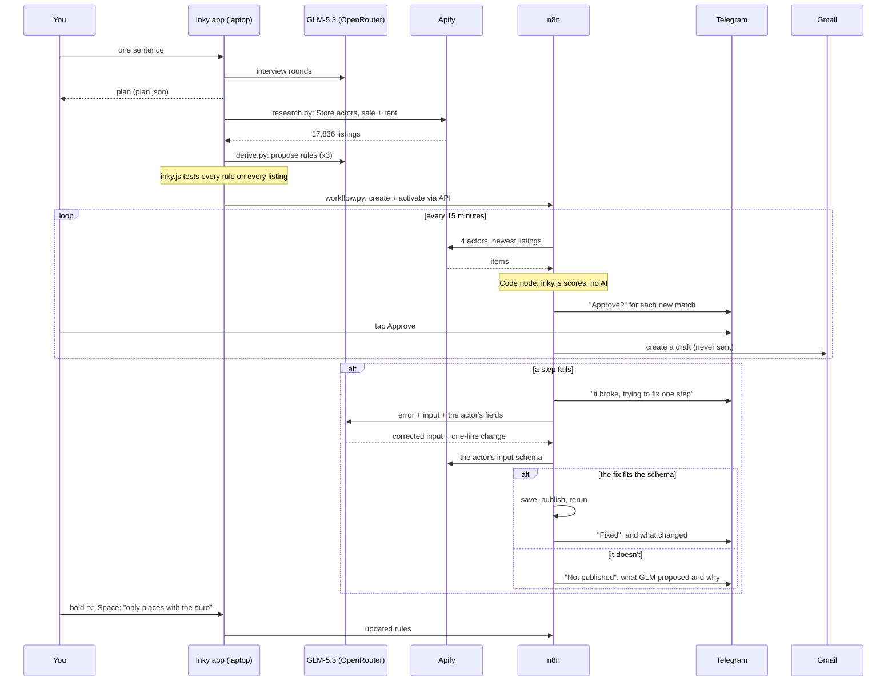

# Inky: architecture

Inky turns one sentence into a watcher that runs by itself. It uses a model where judgement is needed and compiled code everywhere else, so the loop that runs every 15 minutes needs no model.

## Components

| Component | Where it runs | Uses AI? | What it does |
|---|---|---|---|
| Interview (`app/serve.py` `/api/interview`) | your laptop → OpenRouter | GLM-5.3, one call per round, at most 5 rounds | Asks only what it can't guess, and writes down its assumptions. Writes `plan.json`. |
| Research (`research.py`) | Apify cloud | no | Runs Apify Store actors (idealista, immobiliare, otodom) for sale and rent listings in each city, with a hard USD cap per job. Raw items go to `data/raw/`. |
| Normalise and score (`inky.js`) | laptop (Node) and inside the n8n Code node | no | One listing shape for every site. Estimated net yield, price against the neighbourhood, rules check. The same file runs in both places, so n8n runs exactly the rules that were tested. |
| Rules (`derive.py`) | laptop → OpenRouter | GLM-5.3, 1 call per round, 3 rounds | Builds neighbourhood tables (rent and price per m²), adds costs, the Eurostat price trend and the ECB rate. GLM-5.3 proposes rules from the plan; `inky.js` tests them on every listing; GLM sees the result and revises. Writes `data/rules.json` and `data/research.json`. |
| Teach (`teach/learn.py`) | laptop, visible Chrome (Playwright) | GLM-5.3, 1 call at the end | Uses a site with no Apify actor once, the way a person would. Each action becomes a typed step. It watches the network, so when the cards come from a JSON request, that request becomes the program's shortcut. The one GLM call labels the steps and names and types the card fields; the answer is checked against every card seen. Writes `teach/tecnocasa.program.json`. |
| Run a program (`teach/run_program.py`, `teach/actor/`) | laptop, or Apify as the actor `cavernous_stew/inky-tecnocasa-homes` | no | Replays the program with no model: the shortcut (one request per page), or the recorded clicks in Chrome. |
| Race (`race/race.py`) | laptop, 9 Chrome windows | the agent window only | 8 windows replay the compiled program; 1 click-by-click GLM agent does the same task, for comparison. Writes `data/race.json`. |
| Workflow builder (`workflow.py`) | laptop → n8n API | no | Creates the credentials and both workflows, links the repair workflow as the main one's error workflow, and activates them. Keeps the ids in `data/n8n.json`, so a second run updates instead of duplicating. |
| Main workflow | n8n Cloud | no | Every 15 min: 5 Apify steps (the 4 Store actors plus Inky's own Tecnocasa actor; the newest 60 listings per source, a USD cap on each) → Merge → Score (Code node with `inky.js` and the rules) → Telegram question with “Save as draft” / “Skip” buttons (`sendAndWait`) → Gmail draft to the agent, never sent. Plus an 08:00 digest, which also lists up to 3 “almost” homes: new ones that miss exactly one rule by a little (0.3 points on a yield or the price trend, 0.05 on price against the neighbourhood, 5% on price or counts). They are never asked about and never drafted. Quiet hours: matches found between 23:00 and 07:00 wait for the first run after 07:00. |
| Repair workflow | n8n Cloud → OpenRouter | GLM-5.3, 1 call per fix | On an error: tells you on Telegram, finds the broken step, sends GLM-5.3 the error, the step's input and the actor's real input fields, and patches only that input. Before saving, it checks the new input against the actor's input schema, read from Apify (the actor's default build): required fields, allowed values, types, no new fields the actor doesn't have. A fix that fails the check is not published, and you get told on Telegram what GLM proposed and why it was rejected. A fix that passes is saved and published, you get told what changed, and the main workflow runs again. At most one fix an hour. |
| App (`app/serve.py` + `app/static/`) | laptop, 127.0.0.1:8765 | only through the interview, rule commands and share | Shows research, the program, the race, results, the workflow and its runs. `/api/command` turns a sentence into one rule edit, keeps one version back, and pushes the rules to the main workflow. |
| Voice (`voice/`) | laptop | no model for speech (whisper.cpp is local); the command goes to `/api/command` | Hold ⌥ Space in any app: ffmpeg records, whisper.cpp transcribes on the Mac, the text becomes a rule edit. |

## Data flow

## What is AI and what is compiled

| Uses a model | Compiled, no model |
|---|---|
| Interview (≤5 calls per plan) | Scraping (Apify actors) |
| Proposing rules (3 calls) | Normalising and scoring (`inky.js`) |
| Labelling a learned site (1 call) | Replaying a learned site (program or its JSON shortcut) |
| Repairing a broken step (1 call per fix, ≤1 an hour) | The 15-minute n8n loop, Telegram, Gmail drafts, the digest |
| Turning a spoken or typed sentence into one rule edit (1 call) | Speech to text (whisper.cpp, local) |
| Writing a share description (1 call) | Building the n8n workflows (`workflow.py`) |

A model never picks clicks at run time. We tested Laya, a small local model for typed page decisions, and it was only about 50% right on real pages, so it isn't used.

## Costs (measured on Saturday unless marked)

| Item | Cost |
|---|---|
| Research: 17,836 listings through Apify | $17.49 |
| Rules: 3 GLM-5.3 calls | $0.15 |
| Learning Tecnocasa: 1 GLM-5.3 call | $0.02 |
| Actor test run: 20 listings | under $0.001 |
| Race: the click-by-click agent (the compiled windows cost nothing) | $0.085 |
| One 15-minute run: 5 Apify steps, 60 newest listings each | about $0.21 in actor fees (estimate from the actors' per-listing prices), [measured: from the Apify API] |
| One 15-minute run: AI | $0 (no model calls) |
| One repair | one GLM-5.3 call, a few cents |
| n8n | the n8n Cloud plan; self-hosting is free |

## Files

`data/` (git-ignored) holds everything a run produces: `raw/` (Apify items), `zones.json`, `costs.json`, `rules.json`, `research.json`, `race.json`, `n8n.json` (ids of what `workflow.py` created, no secrets). `build.py --offline` writes the same files to `data-offline/` from fixtures. Keys live only in `.env` (git-ignored).

## Limits we know about

- Yields are estimates: the rent is the median €/m² of rentals in the same neighbourhood, and costs are fixed shares per country (`data/costs.json`).
- The price trend is per country (Eurostat, 2026-Q1), not per city.
- Łódź districts are approximated from coordinates, because otodom returns none.
- The repair fixes a step's input (a bad request, or a step that returned nothing). It doesn't yet handle a site that changes the shape of its data.
- Re-learning a broken site (running `teach/learn.py` again) can't start from n8n Cloud: it needs Chrome on your Mac. You run it yourself.
- The marketplace lists real bundles from `share/bundle/` and `data/shared/`; the sample agents on it are marked Preview. `share/export.py` writes a credential-free bundle and `share/import.py` sets it up in another n8n (tested live with `--test`: an inactive copy without credentials, deleted afterwards). The Share button in the app writes a description and a link, not a bundle.
